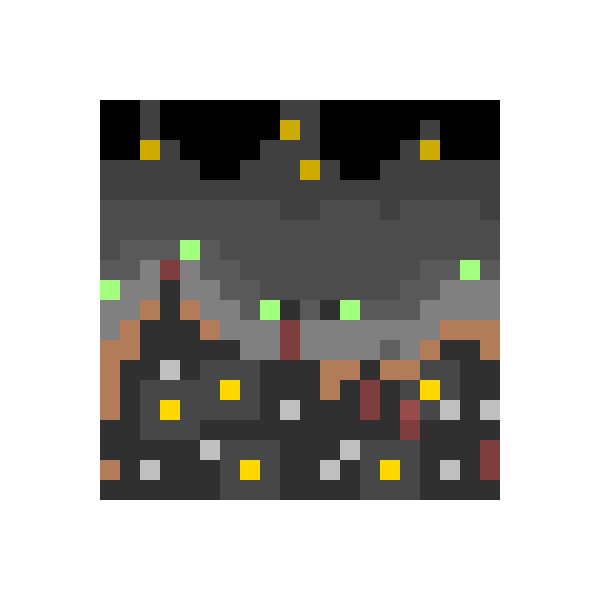
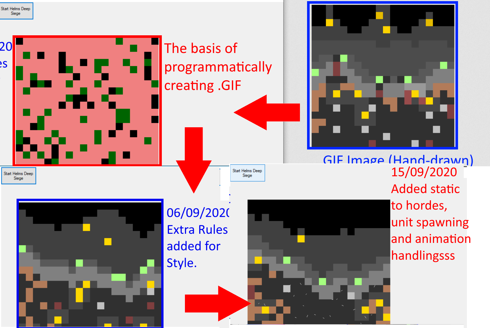
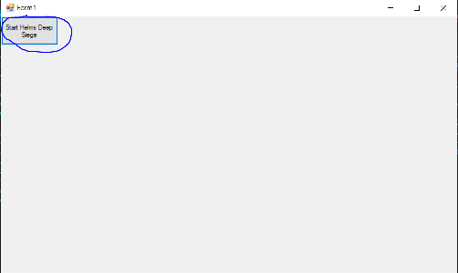

# Helm's Deep GIF Maker -> (Simple Test Project )

This is a short C# project designed to replicate a hand-drawn micro .GIF (animated) image ,by automating the rules I followed while hand-drawing the GIF.

## Notes/Know Bugs:

> No known bugs at the moment. Please email bugfinder@starshiplad.com with any bugs you find.

## Features(Planned In Brackets)

> Automates the hand-drawing process used to draw https://twitter.com/StarshipladDevp/status/1300752966299734017 (displayed above)

> Animated .GIF file

> Export .GIF file after creation

> Animates the inital frame as a PNG

## View of progress

*The below GIF file is output by the program*
![Progress Gif] (Progressgif.gif)

## Latest Build
26/10/2020 1.0 Release.
*4 days after inital time budget*

## Latest Update

26/10/2020 1.0 Release:

WorkerFunctions.DisplayCells -> Modify output pixel-size to 400 so there is no excess canvas.
SiegeFunctions.Directions -> Add enum 'Destroy' so unit can be removed.
WorkerFunctions.SetupAnimation -> Add condition to reove cell if direction is 'destroyed'.
WorkerFunctions.RunAnimation -> Add condition to make cell's direction 'destroy' 1/3 of the time where cell type is 'wounded to enable casulties
WorkerFunctions.FillCells -> Make WallHeight always '8' to make walls straight (Due to customer feedback) 
WorkerFunctions.DisplayCells -> Change ARGB values of walltop,cityproper and bakcgroundcity so they are more visible
WorkerFunctions.DisplayCells -> Randomize 'lighting' change to adjacent ARGB values, to create a 'shimmering' lighting effect
WorkerFunctions.DisplayCells -> Modify condition to add 'static; effect representing infantry, so that is appears on both 'Rohan' and 'Urkahai' ccellTypes
WorkerFunctions.DisplayCells -> Modify wounded draw to increase Cell's 'R' value in it's relevatn brush colour, instead of being pink
WorkerFunctions.HelmsDeepButton -> Add a single draw of 'Help.png' to the side of animation to help readability
SiegeGenerator -> added 'SeigeGen.ico'
SiegeGenerator -> Finish in-code documentation of functions.

## Next Build

No further updates unless bugs arise.
1.0 released.

## Skill developing

I plan on this project improving my skills in the following:

> C#

> File exporting in .NET framework

> Pixel Art and Animation

>

## Installing and Compiling:
* NOTE * Windows machine only

1) Un-ZIP the 'Executable' ZIP file after downloading this repo
2) Double click the 'HelmsDeep.exe' file in the extracted folder
3) Hit 'Start Helm's Deep Siege' To begin animating in the window
4) The Finished .GIF file will be stored in the directory you ran the program from.

