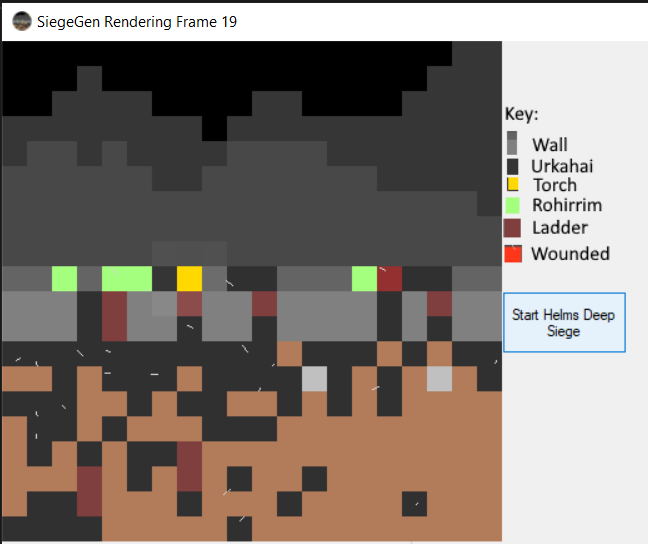

# Helm's Deep GIF Maker -> (Simple Test Project )

This is a short C# project designed to replicate a handdrawn micro .GIF animated image by
automating the rules I followed while hand drawing the GIF.

## Notes/Know Bugs:

> 'Night' Tiles may go down so far there is no 'City' tiles between 'Top Wall' Tiles and 'Night'

## Features(Planned In Brackets)

> (Aniamted .GIF file)

> (Export .GIF file of project)

> Automates the hand-drawing process used to draw https://twitter.com/StarshipladDevp/status/1300752966299734017

> Animates the inital frame

## View of progress

## Latest Build
Still In progress

## Latest Update

13/09/2020 - Animation 0.5

> Add changes.txt file to log changes
> WorkerFUnctions.cs -> Add 'SetupSiegeCellAnimation' Method to input next animation details
> Globals.cs -> Move wall and cityheight variables to 'Globals.cs' to be refrenced in animation code
> WorkerFUnctions.cs -> Add 'RunAnimation' Method to change siegecells array as per 'SetupSiegeCellAnimation'
> WorkerFUnctions.cs -> Modify HemlsDeepButton function to run the above two animation commands 20 times, with a 1.5 second break between
> Globals.cs -> Add utility function 'PrintSigeCells' to print each cell's direction and type

## Next Build

Week ending 20/09/2020

* Add button that animates from the index image

* Add 'combat' automation and ladder scaling

* GIF Output(Maybe release after)

* Help button for .GIF example

## Skill developing

I plan on this project improving my skills in the following:

> C#

> File exporting in .NET framework

>Pixel Art and Animation

## Installing and Compiling:

Work in progress
