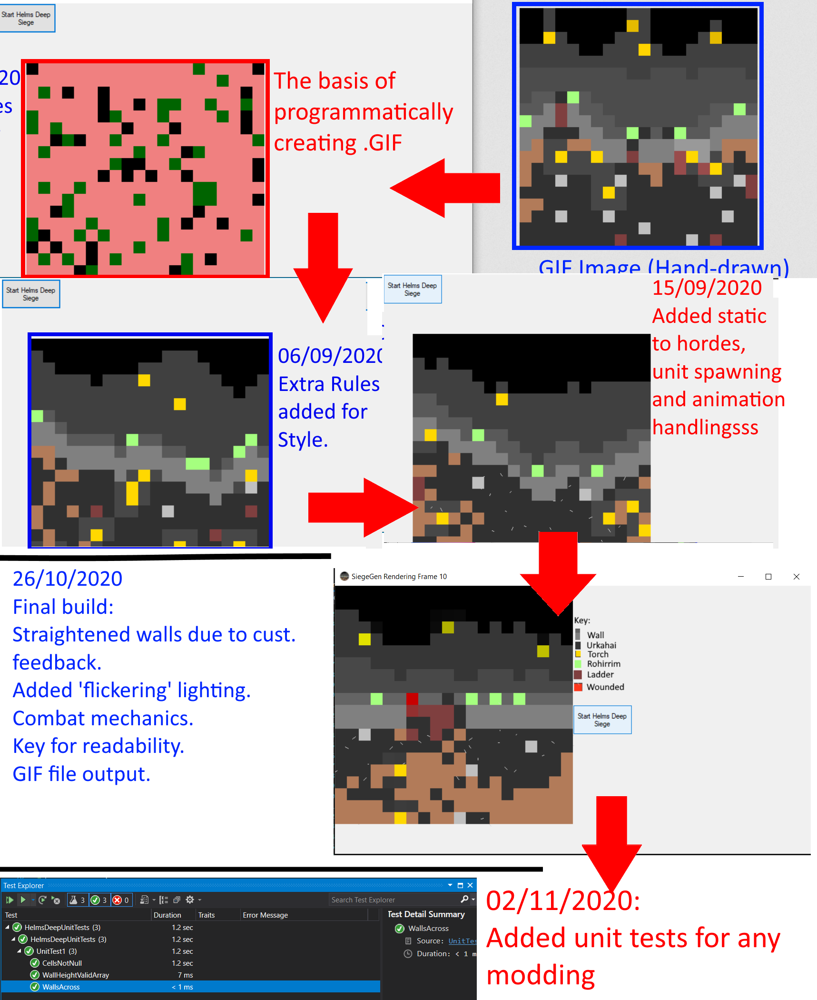

# Helm's Deep GIF Maker -> (Simple Test Project )

This is a short C# project designed to replicate a handdrawn micro .GIF animated image by
automating the rules I followed while hand drawing the GIF.

## Notes/Know Bugs:

> 'Night' Tiles may go down so far there is no 'City' tiles between 'Top Wall' Tiles and 'Night'

## Features(Planned In Brackets)

> (Aniamted .GIF file)

> (Export .GIF file of project)

> Automates the hand-drawing process used to draw https://twitter.com/StarshipladDevp/status/1300752966299734017

> Animates the inital frame

## View of progress

## Latest Build
Still In progress

## Latest Update

12/10/2020- Unit Handling
	HelmsDeepApp -> Add GifWriter Class to output .GIF files from series of .PNGs
	WorkerFunctions.cs>HelmsDeepButton -> Add creation of GifWriter before main loop to handel GIF creation
	WorkerFunctions.cs>HelmsDeepButton -> Add Each 'DispalyCell' Grpahic in main loop to the above GifWriter to create output content
	WorkerFunctions.cs>DisplayCell -> Modify to take a Bitmap as a parameter, drawing to that then copying that Grpahic to the relevant 'Form' so 
		that graphics are being drawn to an object that can can be saved.
## Next Build

Week ending 11/10/2020 -Release 1.0 ***DELAYED*** New Release 31/10/2020

* Add casulty/unit removal after enough 'wounds'

* Improve the Background City, add bomb handling

* GIF Output

* Help button for .GIF example

## Skill developing

I plan on this project improving my skills in the following:

> C#

> File exporting in .NET framework

>Pixel Art and Animation

## Installing and Compiling:
* NOTE * Windows machine only

1) Un-ZIP the 'Executable' ZIP file after downloading this repo
2) Double click the 'HelmsDeep.exe' file in the extracted folder
3) Hit 'Start Helm's Deep Siege' To begin animating in the window
4) The Finished .GIF file will be stored in the dir you ran the program from.

